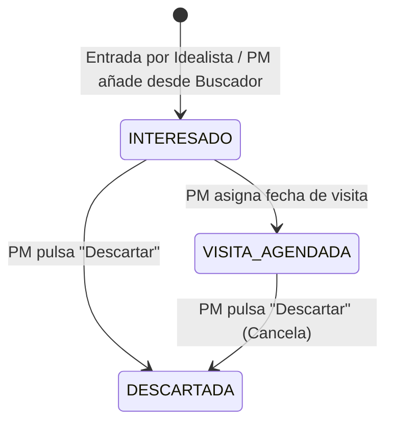

# Máquina de Estados: Mini-tarjetas de Propiedades

> Representa la relación entre un **Lead** (Interesado) y una **Propiedad** específica.

## Diagrama de Estados

## Estados definidos

| Estado | Descripción |
|--------|-------------|
| **INTERESADO** | Estado inicial. El lead muestra interés en la propiedad (vía Idealista o añadido manualmente por el PM). |
| **VISITA_AGENDADA** | El PM ha asignado una fecha de visita para esa propiedad. |
| **DESCARTADA** | Válvula de escape. El PM descarta la propiedad para ese lead (antes o después de agendar visita). |

## Transiciones

| Desde | Hacia | Acción |
|-------|-------|--------|
| `[*]` | INTERESADO | Entrada por Idealista o PM añade desde Buscador |
| INTERESADO | VISITA_AGENDADA | PM asigna fecha de visita |
| INTERESADO | DESCARTADA | PM pulsa "Descartar" |
| VISITA_AGENDADA | DESCARTADA | PM pulsa "Descartar" (Cancela visita) |
